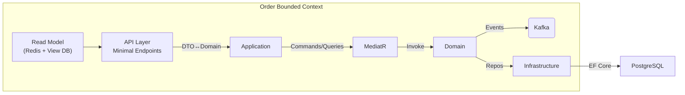

# PWorx Microservice BoilerPlate

A **reference implementation** of a lightweight Order Management System that showcases:

* **Domain‑Driven Design (DDD)** – clear separation of Bounded Contexts, rich domain model, Value Objects & Aggregates.  
* **CQRS + Mediator** – commands (write) and queries (read) handled by MediatR to keep intent explicit and side‑effects isolated.  
* **SOLID principles** – single‑responsibility, dependency inversion via DI, open/closed domain services, etc.

> **Why this project?**  
> Recruiters and peers can dig into real code that demonstrates clean architecture, scalable patterns and production‑ready practices in a bite‑sized repo.

---

## ⚙️ Tech Stack

| Layer | Tech | Notes |
|-------|------|-------|
| API & Hosting | **ASP.NET Core 9 Web API** | Minimal APIs with Swagger & versioning |
| Mediator / CQRS | **MediatR** | Commands, Queries, Notifications |
| Persistence | **PostgreSQL** + **EF Core** | DbContext per Bounded Context, Code‑First Migrations |
| Messaging (async) | **Kafka** (via Confluent.Kafka) | Event publishing for Order domain events |
| Caching | **Redis** | Read‑model caching, idempotency tokens |
| Container & Orchestration | **Docker** & **Azure AKS** | Compose for local dev, Helm chart for AKS |
| Observability | **Serilog**, **OpenTelemetry**, **Prometheus + Grafana** | Structured logs, traces & metrics |
| Tests | **nUnit**, **FluentAssertions**, **NSubstitute** | Unit, integration & contract tests |

---

## 🏗️ Architecture at a Glance


### Caching Layer
The application now uses **Redis** for caching query results. A view database is accessed via EF Core to serve read models, and cached entries expire after a short period to keep data fresh.

### Observability Layer
**Serilog** handles structured logging while **OpenTelemetry** collects traces and metrics. Metrics are exposed at `/metrics` for Prometheus and can be visualized in **Grafana**.
Global exception handling with structured logs is provided via `ErrorHandlingMiddleware`, and MediatR requests are logged through a `LoggingBehavior`.

## 📝 Architecture Decisions

The boilerplate is intentionally opinionated to keep the example small yet realistic. Key design choices include:

* **Bounded Context per Service** – the repository focuses on an `OrderService` microservice to illustrate a DDD approach where each context owns its domain model.
* **Minimal API Controllers** – endpoints only route HTTP requests and forward them to the application layer. Business logic lives in MediatR handlers to keep controllers lightweight.
* **CQRS with MediatR** – commands mutate state while queries load read models. This separation clarifies intent and enables cross-cutting behaviors through pipeline modules.
* **EF Core Write Model** – relational persistence is handled via Entity Framework Core with a dedicated `OrderDbContext` and repository. Migrations are code-first for simplicity.
* **Redis-backed View Repository** – read operations go through an `OrderViewRepository` that combines EF Core queries with Redis caching to demonstrate a simple read model pattern.
* **Kafka Domain Events** – important domain events are published to Kafka using a small `KafkaBroker` abstraction so other services can react asynchronously.
* **Observability by Default** – Serilog and OpenTelemetry are integrated from the start with Prometheus scraping enabled at `/metrics`.
* **Docker and Kubernetes** – a Dockerfile and `k8s` manifests are provided to run the service in containers and deploy to Azure AKS.

## 📁 Folder Structure

```
src/
  PWorx.MicroserviceBoilerPlate/
    Domain/                       -- Shared domain services
    OrderService/
      API/                        -- Minimal API endpoints
      Application/                -- CQRS commands, queries and handlers
      Domain/                     -- Entities and domain events
      Infrastructure/             -- EF Core data and middleware
    k8s/                          -- Kubernetes deployment manifests
tests/
  Application/                    -- Tests for the application layer
  Domain/                         -- Tests for domain logic
  Infrastructure/                 -- Tests for persistence and middleware
```

The repository separates production code under `src` from test projects in
`tests`. Inside the microservice project, folders map to the main layers of a
Domain‑Driven Design architecture: `Domain` contains the core business logic,
`Application` handles orchestration and MediatR behaviors, `API` exposes the
HTTP endpoints, and `Infrastructure` isolates data access and cross‑cutting
concerns. Deployment descriptors live in the `k8s` folder so the service can be
packaged and deployed alongside the codebase.

## 📚 Library Choices

The project references a minimal set of NuGet packages to keep the example focused yet realistic:

| Package | Reason |
|---------|-------|
| **MediatR** | Implements the mediator pattern to decouple controllers from business logic and enable the CQRS style. |
| **Microsoft.AspNetCore.OpenApi** | Provides the `AddOpenApi` helpers that quickly enable Swagger documentation. |
| **Confluent.Kafka** | Lightweight Kafka client used by the domain to publish events without pulling in an entire messaging framework. |
| **Microsoft.EntityFrameworkCore** + **Npgsql.EntityFrameworkCore.PostgreSQL** | Gives a modern ORM for the write model backed by PostgreSQL. |
| **Microsoft.Extensions.Caching.StackExchangeRedis** | Adds Redis caching to support the read model repository. |
| **OpenTelemetry** packages | Collect traces and metrics so the service can be observed in production environments. |
| **Serilog.AspNetCore** + **Serilog.Sinks.Console** | Structured logging configured in <code>Program.cs</code> with console output for local development. |


## 🚀 Docker & AKS Deployment

To build the container image locally run:

```bash
docker build -t order-service .
```

Push the image to your registry (e.g. Azure Container Registry) and update the
`image` field in `k8s/deployment.yaml` accordingly. Then apply the manifests to
an AKS cluster:

```bash
kubectl apply -f k8s/deployment.yaml
kubectl apply -f k8s/service.yaml
```
