# dotnet‑microservices‑boilerplate

A **reference implementation** of a lightweight Order Management System that showcases:

* **Domain‑Driven Design (DDD)** – clear separation of Bounded Contexts, rich domain model, Value Objects & Aggregates.  
* **CQRS + Mediator** – commands (write) and queries (read) handled by MediatR to keep intent explicit and side‑effects isolated.  
* **SOLID principles** – single‑responsibility, dependency inversion via DI, open/closed domain services, etc.

> **Why this project?**  
> Recruiters and peers can dig into real code that demonstrates clean architecture, scalable patterns and production‑ready practices in a bite‑sized repo.

---

## ⚙️ Tech Stack

| Layer | Tech | Notes |
|-------|------|-------|
| API & Hosting | **ASP.NET Core 9 Web API** | Minimal APIs with Swagger & versioning |
| Mediator / CQRS | **MediatR** | Commands, Queries, Notifications |
| Persistence | **PostgreSQL** + **EF Core** | DbContext per Bounded Context, Code‑First Migrations |
| Messaging (async) | **Kafka** (via Confluent.Kafka) | Event publishing for Order domain events |
| Caching | **Redis** | Read‑model caching, idempotency tokens |
| Container & Orchestration | **Docker** & **Azure AKS** | Compose for local dev, Helm chart for AKS |
| Observability | **Serilog**, **OpenTelemetry**, **Prometheus + Grafana** | Structured logs, traces & metrics |
| Tests | **xUnit**, **FluentAssertions**, **NSubstitute** | Unit, integration & contract tests |

---

## 🏗️ Architecture at a Glance

```mermaid
flowchart LR
    subgraph Order Bounded Context
        API[API Layer<br/>Minimal Endpoints] -->|DTO↔Domain| Application
        Application -->|Commands/Queries| MediatR
        MediatR -->|Invoke| Domain
        Domain -->|Events| KafkaBroker(Kafka)
        Domain -->|Repos| Infrastructure
        ReadModel["Read Model<br/>(Redis + View DB)"]
    end
    Infrastructure -->|EF Core|PostgreSQL
    ReadModel --> API
```


### Caching Layer
The application now uses **Redis** for caching query results. A view database is accessed via EF Core to serve read models, and cached entries expire after a short period to keep data fresh.

### Observability Layer
**Serilog** handles structured logging while **OpenTelemetry** collects traces and metrics. Metrics are exposed at `/metrics` for Prometheus and can be visualized in **Grafana**.
Global exception handling with structured logs is provided via `ErrorHandlingMiddleware`, and MediatR requests are logged through a `LoggingBehavior`.

## 🚀 Docker & AKS Deployment

To build the container image locally run:

```bash
docker build -t order-service .
```

Push the image to your registry (e.g. Azure Container Registry) and update the
`image` field in `k8s/deployment.yaml` accordingly. Then apply the manifests to
an AKS cluster:

```bash
kubectl apply -f k8s/deployment.yaml
kubectl apply -f k8s/service.yaml
```

This creates a Deployment and an external Service for the API.
